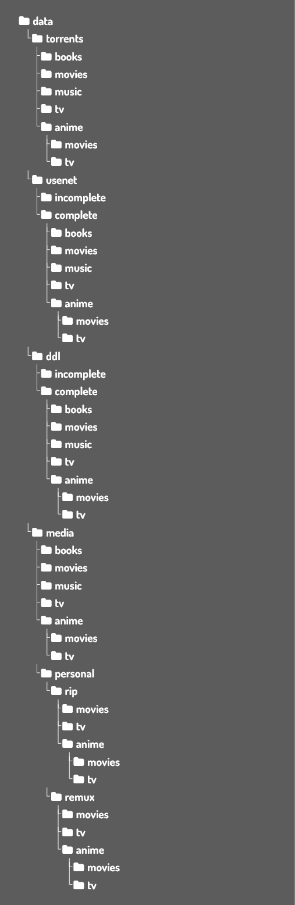

# MediaServer

# Media Server Directory Structure

## Overview
This project defines a **standardized directory hierarchy** for organizing media files across different acquisition methods (torrents, usenet, direct downloads) and finalized libraries.  

The structure is designed for:  
- **Security** – Applications only access what they need.  
- **Efficiency** – Hardlinks prevent duplicate storage, atomic moves allow instant relocation.  
- **Consistency** – All apps (native or containerized) reference the same paths.  
- **Scalability** – Clear separation between incoming downloads and finalized libraries.  

---

## Requirements
1. **Single file system** – All media must be stored on one physical or virtual drive.  
2. **Consistent path mapping** – Applications should use the same logical root (e.g. `/data`).  
3. **Separation of sources** – Downloads remain isolated until they are verified and moved into the `media` library.  

---

## Directory Structure


## Folder Responsibilities
- **torrents / usenet / ddl**  
  - `incomplete` → Active downloads.  
  - `complete` → Finished downloads, staged for processing.  

- **media**  
  - Finalized library used by Plex, Jellyfin, Emby, etc.  
  - Categories: `books`, `movies`, `music`, `tv`, `anime`.  

- **personal**  
  - `rip` → Direct disc rips (DVD, Blu-ray, UHD).  
  - `remux` → Stream-preserving repackages or reorganized versions of rips.  

---

## Application Integration
- **Native installs** → Applications see the structure directly if permissions are correct.  
- **Docker/containers** → Map host directories into containers consistently. Example for a torrent client:  

```yaml
volumes:
  - /mnt/user/data/torrents:/data/torrents
````

All containers should use `/data` as the logical root for clean handoffs across the pipeline.

---

## Automation Script

You can auto-generate the folder tree with the included Python script:

```bash
python3 create_media_structure.py --path /mnt/user
```

Arguments:

* `--path` → Base directory where `data/` will be created (default: current directory).

---

## Workflow (Typical)

```
torrents / usenet / ddl → staging (complete) 
→ media (organized library) 
→ personal/rip or personal/remux (if created by you)
```
